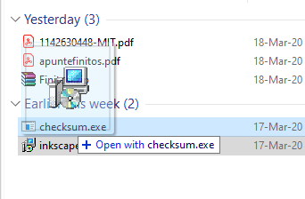
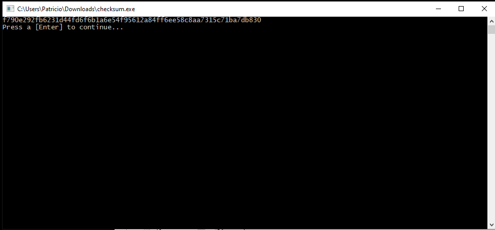

# SHA-256 checksum
Check your file's hash in seconds with an easy to use binary.

## Easy to use
Just drag-and-drop the file onto checksum.exe. The SHA-256 checksum will be printed to command line!

Or just open it and type in the filename (with extension!)

## Screenshot
